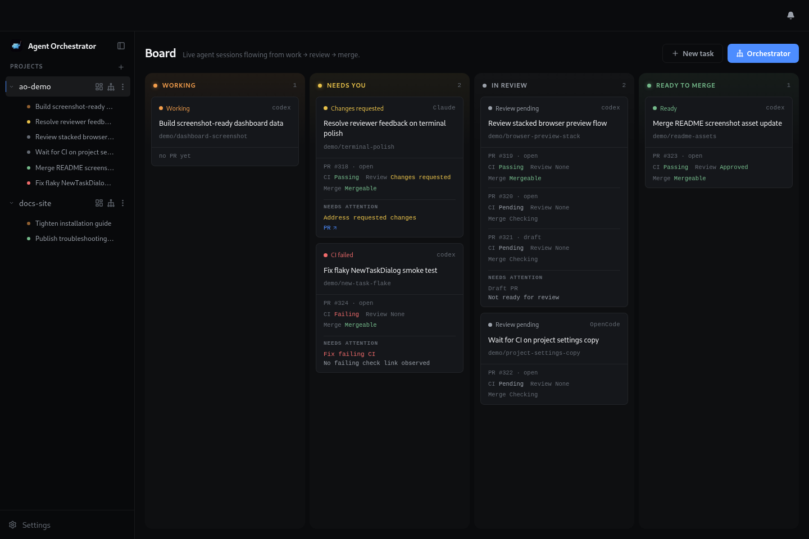
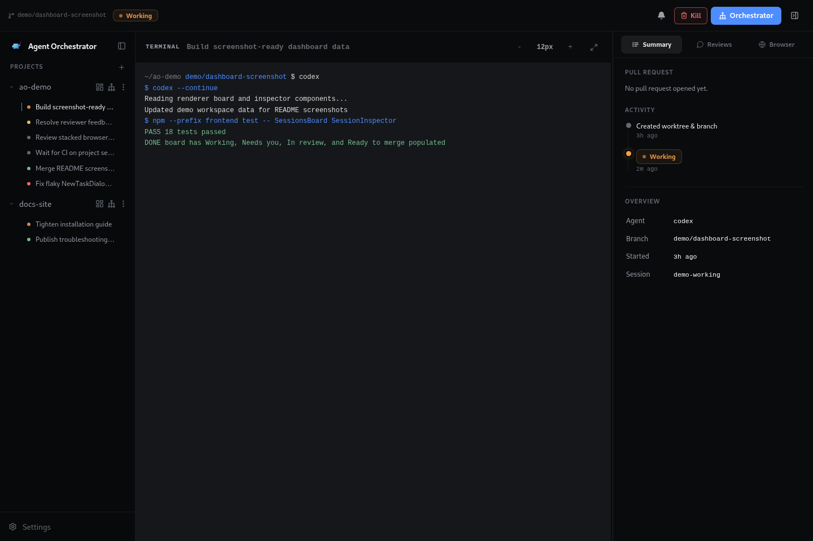
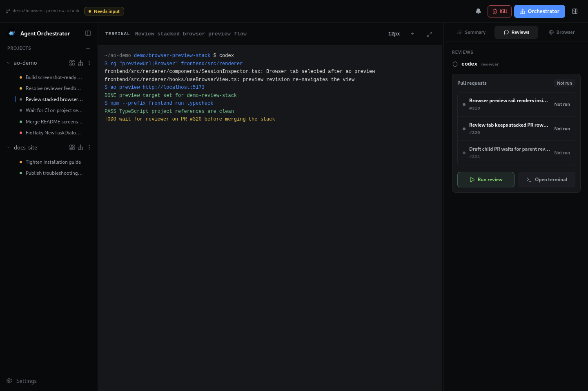
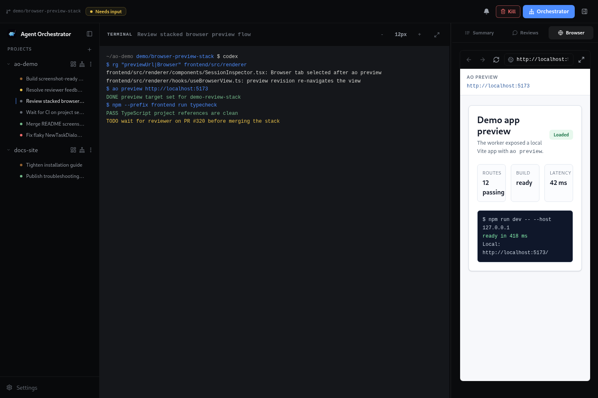
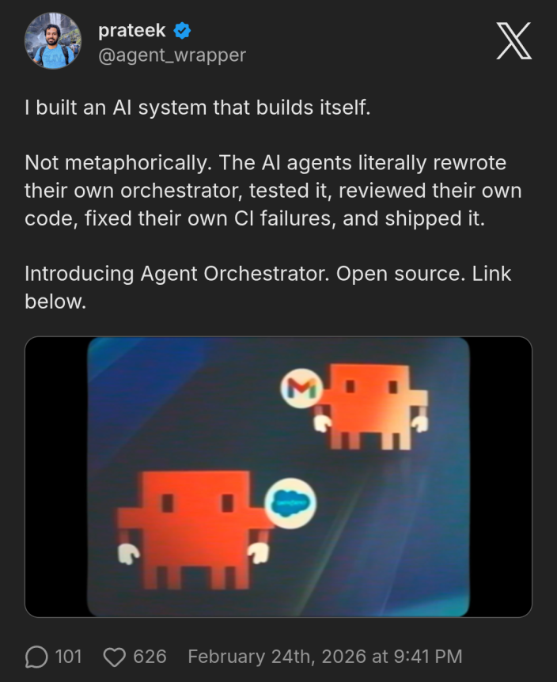
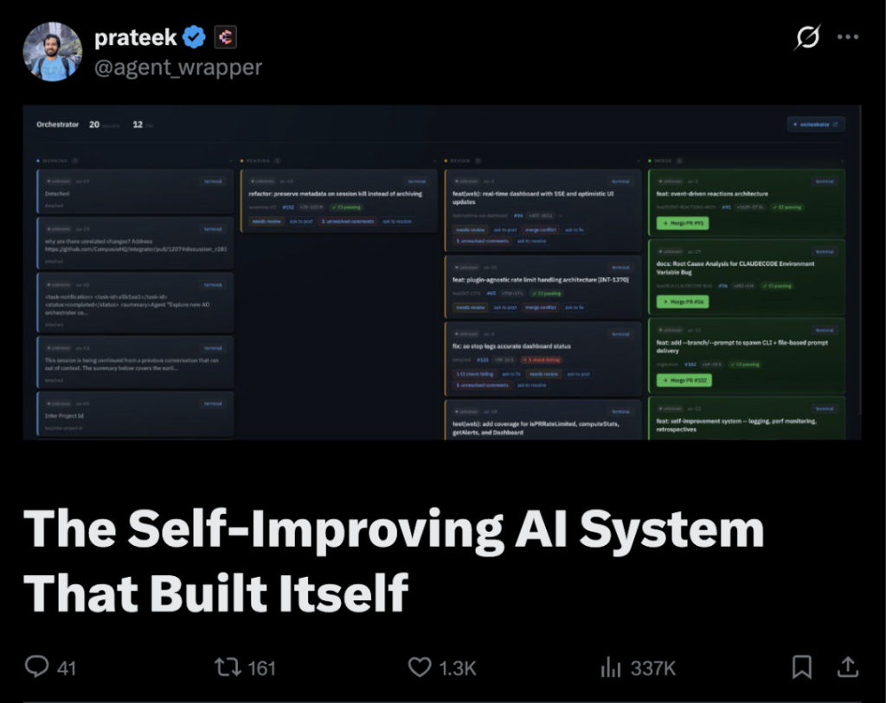

> **Fork notice — ao-paseo-integration**
>
> This is a fork of [Untrivial-ai/agent-orchestrator](https://github.com/Untrivial-ai/agent-orchestrator)
> (Apache-2.0) that adds a first-class `ExecutionBackend` port so AO can drive **stock
> [Paseo](https://paseo.sh) installations as remote execution backends**, while remaining the sole
> durable control plane.
>
> Paseo is **not** forked and its source is **not** vendored here — it is a separate installed
> program, interacted with only through its CLI. Paseo is AGPL-3.0-or-later; this fork stays
> Apache-2.0. See [`docs/paseo-integration/`](docs/paseo-integration/) for the design documents,
> the compatibility spike, and the supply-chain audit.
>
> **Setup for this fork is below.** Upstream README follows after it.

---

## Setup (this fork)

Four parts: local work on the AO machine, turning a machine into a **host** AO can
dispatch to, registering that host, and keeping the files that steer agents
(preferences, instructions, skills) in sync.

Which machine needs what:

| | AO machine | Host (worker) |
|---|---|---|
| Go 1.25+, this repo, the `ao` binary | **yes** | no |
| Node 20+ | yes | **yes** (Paseo ships as an npm CLI) |
| Paseo CLI, pinned 0.2.5 | for remote features | **yes** |
| Agent CLIs, *logged in* | for local sessions | **yes** — this is where work runs |
| git + a checkout of each project | yes | **yes**, at the path you bind |

### 1. Local work (the AO machine)

Everything upstream AO does works unchanged; remote execution is additive.

1. **Prerequisites**: Go 1.25.7+, Node 20.19+ / npm 10+, git, and at least one
   agent CLI you are logged into (`claude`, `codex`, …). Both toolchains install
   under `$HOME`, so none of this needs `sudo`:

   ```bash
   # Go — match the flake's 1.25 series; go.mod requires 1.25.7+
   curl -fsSLO https://go.dev/dl/go1.25.14.linux-amd64.tar.gz
   mkdir -p ~/.local && tar -C ~/.local -xzf go1.25.14.linux-amd64.tar.gz

   # Node 22 LTS via nvm
   curl -fsSL https://raw.githubusercontent.com/nvm-sh/nvm/v0.40.3/install.sh | bash
   export NVM_DIR="$HOME/.nvm" && . "$NVM_DIR/nvm.sh" && nvm install 22

   # Put both on PATH for login shells
   cat >> ~/.profile <<'EOF'
   export PATH="$HOME/.local/go/bin:$HOME/go/bin:$PATH"
   export NVM_DIR="$HOME/.nvm"
   [ -s "$NVM_DIR/nvm.sh" ] && . "$NVM_DIR/nvm.sh"
   EOF
   ```

   `nvm` only wires itself into `~/.bashrc`, which Ubuntu skips for
   non-interactive shells — so a bare `bash -lc 'npm …'` (any script, any CI
   step) will not find npm until it is on the login-shell PATH as above.
   `nix develop` gets you the same toolchain in one step if you have Nix.

2. **Install dependencies** from the repo root — **three** installs, not two.
   `frontend/src/landing` is a separate npm package that is *not* a workspace of
   `frontend`, so the frontend install does not reach it. Skipping it leaves
   `cheerio` missing and 5 tests in
   `src/landing/scripts/generate-markdown-twins.test.mjs` fail with
   `ERR_MODULE_NOT_FOUND` — CI installs it as its own step
   (`.github/workflows/frontend.yml`).

   ```bash
   npm install
   npm --prefix frontend install
   npm ci --prefix frontend/src/landing
   ```

3. **Build the CLI/daemon**:

   ```bash
   cd backend && go build -o "$HOME/.local/bin/ao" ./cmd/ao
   ```

4. **Start AO**: `ao start` opens the desktop app (starting the daemon if
   needed); `ao status` / `ao stop` manage it. All state lives under `~/.ao`
   (override with `AO_DATA_DIR`) — never in `~/Library/Application Support`.
   The daemon's liveness routes are `/healthz` and `/readyz`; there is no
   `/api/health`.
5. **Add a project and work locally**:

   ```bash
   ao project add --path ~/code/my-repo --name my-repo
   ao spawn ...   # or start sessions from the board in the app
   ```

6. **Verify a checkout** before hacking on this fork. One command covers build,
   the test regression gate, lint, typecheck, and generated-artifact drift:

   ```bash
   ./scripts/verify-fork-baseline.sh     # must end in VERIFY PASS
   npm --prefix frontend run test        # 1580 tests; needs step 2's third install
   ```

   The gate compares failing tests against `scripts/known-failing-tests.txt`
   rather than requiring green, because the fork inherited failing tests from
   upstream — it fails only on a *regression*. `npm run lint` and
   `npm run frontend:typecheck` remain available individually.

### 2. Turning a machine into a host (a "computer")

A host runs a **stock** Paseo daemon plus the agent CLIs. It does **not** need
Go, this repository, the `ao` binary, or the desktop app — AO reaches it over
Paseo's CLI and HTTP surface only. The daemon AO drives is headless by design.

**On the worker machine:**

1. **Install the agent CLIs and log them in as the user that will run work.**
   An agent on a machine with no `claude` login just answers "Not logged in",
   and nothing upstream of it will tell you that is why. Verify per provider —
   for Claude Code, `~/.claude/.credentials.json` should exist after `claude`
   completes its login.
2. **Install Paseo at exactly 0.2.5.** The pin is an equality check, not a
   floor: `adapters/execution/paseo/version.go` compares `paseo --version`
   against `SupportedVersion` and refuses anything else, because the JSON shapes
   the adapter parses are fixture-verified against that one build. npm's
   `latest` is well past it.

   ```bash
   npm install -g @getpaseo/cli@0.2.5
   paseo --version    # must print exactly 0.2.5
   ```

3. **Start the daemon in the required posture.** From a checkout of this repo,
   `./scripts/paseo-host-setup.sh` does all of it — generates a password,
   writes a hardened `config.json`, starts the daemon, probes it, and prints the
   `ao remote register` line to run on the AO machine. `status`, `stop`, and
   `systemd-unit` are also subcommands. On Windows use
   `.\scripts\paseo-host-setup.ps1` (same posture and guards; `scheduled-task`
   replaces `systemd-unit`) and see *Hosting on Windows* below. By hand:

   ```bash
   export PASEO_HOME="$HOME/.paseo-ao"        # NOT ~/.paseo — see below
   mkdir -p "$PASEO_HOME" && chmod 700 "$PASEO_HOME"
   ( umask 077; openssl rand -hex 24 > "$PASEO_HOME/daemon-password" )

   env -u PASEO_AGENT_ID -u PASEO_WORKSPACE_ID -u PASEO_HOST \
     PASEO_PASSWORD="$(cat "$PASEO_HOME/daemon-password")" \
     paseo daemon start --home "$PASEO_HOME" --listen 127.0.0.1:6780 \
       --no-relay --no-mcp --no-inject-mcp --no-web-ui
   ```

   Every flag is load-bearing, and `docs/paseo-integration/SECURITY.md` §3 has
   the reasoning. Two of the stock defaults fail **open** and are worth
   restating: the relay is enabled by default and dials out at boot, and
   `daemon.cors.allowedOrigins` defaults to `["https://app.paseo.sh"]`, which
   hands any JS on that origin a `scopes:["*"]` session on your daemon with no
   password. The flags cover this run; the persisted `config.json` is what
   protects the *next* one, so pin it too:

   ```json
   { "version": 1,
     "daemon": {
       "listen": "127.0.0.1:6780",
       "cors": { "allowedOrigins": [] },
       "relay": { "enabled": false },
       "mcp": { "enabled": false, "injectIntoAgents": false },
       "browserTools": { "enabled": false } },
     "features": {
       "dictation": { "enabled": false },
       "voiceMode": { "enabled": false } } }
   ```

   The `features` block is not cosmetic. Dictation and voice mode default to
   **on** with provider `local`, so a stock daemon starts downloading speech
   models on its first boot — measured at **983 MB** in
   `$PASEO_HOME/models/local-speech` (`parakeet-tdt-0.6b-v2-int8` and
   `kokoro-en-v0_19`) before anything asked it to. There is no flag for this; the
   config keys are the only off switch, and a headless worker never uses either
   feature. With them set, the boot log reads `"enabled":false` for all four
   speech providers and no `models` directory is created.

   **Use a separate `PASEO_HOME`, never `~/.paseo`.** That is the desktop app's
   home, and its daemon reports `desktopManaged: true`, which AO refuses to
   drive outright (`adapters/execution/paseo/backend.go`). Pointing AO at it
   yields a host that registers and then refuses every dispatch.

4. **Make the address reachable, and only just.** The daemon is plaintext HTTP —
   `bootstrap.ts` has no TLS to enable — and the password buys terminal write
   access, project `env` secrets, and a persistent push tap. So:
   - AO on the same machine → keep `127.0.0.1`.
   - AO elsewhere → put both machines on Tailscale and bind **that interface's
     address** (`--listen 100.x.y.z:6780`), which is what `--transport
     tailscale` expects.
   - Not `0.0.0.0`. SECURITY.md §3 says never a LAN interface, and `0.0.0.0`
     is every interface including the LAN.
   - On WSL2 with default NAT networking, a daemon inside the distro is
     reachable from its own Windows host but not from the network; run
     Tailscale inside the distro, or switch WSL to mirrored networking, before
     expecting a remote AO to reach it.

5. **Check the repo is checked out here**, and note the absolute path — that is
   what you bind in step 3 of the next section.

6. **Confirm the daemon answers**, which is the same surface AO probes
   (`GET /api/status`; only `/api/health` is password-exempt):

   ```bash
   curl -s -H "Authorization: Bearer $(cat "$PASEO_HOME/daemon-password")" \
     http://127.0.0.1:6780/api/status
   # {"status":"server_info","serverId":"srv_…","version":"0.2.5","listen":"127.0.0.1:6780"}
   ```

**Two things to know about the password.** It reaches the daemon's environment,
and stock Paseo 0.2.5 strips only five runtime-control keys before spawning an
agent — so every agent on this host can read `PASEO_PASSWORD` with `printenv`,
and so can that agent's model vendor (SECURITY.md §6). Do not patch the
installed Paseo to fix it: running a modified AGPL daemon that serves clients
over a network engages AGPL §13. Instead treat the password as scoped to this
one daemon, never reused, and rotate it by replacing the file and restarting.
`paseo daemon set-password` stores a *hashed* password in `config.json` and
avoids the environment entirely; it prompts interactively, so it is a manual
hardening step rather than a scriptable one.

**Do you still get the Paseo app on a host?** Yes — but not on this daemon.
`--no-web-ui` removes the bundled UI, `--no-relay` stops it reaching
`app.paseo.sh`, and empty CORS blocks that origin anyway. Run the desktop app
as its own daemon with its own `PASEO_HOME` and port; AO refuses to drive a
desktop-managed daemon, so the two coexist without contending. They do not share
state: the app will not show AO's remote sessions, because those live in the
AO-owned home.

#### Hosting on Windows

A Windows box is a first-class host: Paseo 0.2.5 is an npm CLI, and `node-pty`
ships a **win32-x64 conpty prebuild** (`conpty.node`, `conpty.dll`,
`OpenConsole.exe`), so `npm install -g` compiles nothing and Visual Studio Build
Tools are **not** required. Verified on Windows 11 (build 26200) against
Node 22.23.2: daemon up, `GET /api/status` returning
`{"status":"server_info","serverId":"srv_…","version":"0.2.5"}`, password
enforced. `sherpa-onnx-win-x64` resolves too, so nothing is skipped.

Nothing here needs administrator rights, which matters because an elevated
installer cannot be driven from a script:

```powershell
# 1. Node 22 LTS, user-local from the official zip - no MSI, no UAC prompt
$v = 'v22.23.2'
Invoke-WebRequest "https://nodejs.org/dist/$v/node-$v-win-x64.zip" -OutFile "$env:TEMP\node.zip"
Expand-Archive "$env:TEMP\node.zip" "$env:LOCALAPPDATA\node" -Force
$nodeDir = "$env:LOCALAPPDATA\node\node-$v-win-x64"

# 2. Keep global installs in the user profile, so -g never needs admin either
& "$nodeDir\npm.cmd" config set prefix "$env:LOCALAPPDATA\npm-global"
$env:Path = "$nodeDir;$env:LOCALAPPDATA\npm-global;$env:Path"

# 3. Paseo at the pinned version, plus the agent CLIs this host will run
npm install -g @getpaseo/cli@0.2.5
npm install -g @anthropic-ai/claude-code
paseo --version      # must print exactly 0.2.5
claude               # log in - a host with no login just answers "Not logged in"

# 4. Start the daemon in the required posture
.\scripts\paseo-host-setup.ps1                        # loopback only
.\scripts\paseo-host-setup.ps1 -Listen 100.x.y.z:6780 # over Tailscale
.\scripts\paseo-host-setup.ps1 scheduled-task         # print a logon task
```

Add `%LOCALAPPDATA%\node\node-v22.23.2-win-x64` and
`%LOCALAPPDATA%\npm-global` to your user `Path` to make this survive a new
shell. Windows specifics worth knowing:

- **Bind project paths to a drive letter** (`C:\Users\you\code\repo`), never a
  `\\wsl.localhost\…` path. Git worktrees over the 9p share are slow and lose
  file modes, so a Windows host wants its own checkout — it does not share your
  WSL clones.
- **Run the CLI from a real drive path.** `npm.cmd` and any `cmd.exe` shim print
  `UNC paths are not supported. Defaulting to Windows directory` and silently
  change directory when the working directory is a UNC path.
- **A logon task, not a service.** The agent CLIs store credentials per user
  (`%USERPROFILE%\.claude\.credentials.json`), so a SYSTEM-level service has no
  login to run work with. `scheduled-task` prints a `schtasks /SC ONLOGON`
  wrapper that sets `PATH` and the password explicitly, because a task does not
  read your shell profile.
- **WSL on the same box is a *different* host.** Its daemon is reachable from
  Windows on `127.0.0.1` via the WSL localhost relay, so the two contend for a
  port: give them separate ports and separate `PASEO_HOME`s, or run only one.

### 3. Registering the host (on the AO machine)

Hosts are registered by hand and selected by AO's router — never named at
dispatch time.

1. **Store the credential as a secret ref** — a file, never a value inside an
   endpoint or command line:

   ```bash
   mkdir -p ~/.ao/secrets && chmod 700 ~/.ao/secrets
   printf '%s' '<the password>' > ~/.ao/secrets/office-mac-pw
   chmod 600 ~/.ao/secrets/office-mac-pw
   ```

   (The **Settings → Computers → Add computer** sheet does this for you when
   you paste the password there.)
2. **Register the computer** — in the app via *Settings → Computers → Add
   computer* (connection → details → review), or:

   ```bash
   ao remote register office-mac --name "Office Mac" \
     --transport tailscale --endpoint office-mac.tailnet.ts.net:6780 \
     --secret-ref office-mac-pw --trust-zone work --max-sessions 3
   ```

   The endpoint must contain a `host:port` colon — Paseo resolves a colonless
   host to the *local* daemon, which would run remote work on the AO machine.
   Registering an endpoint that resolves to the AO machine's own daemon is
   refused (`HOST_IS_SELF`).
3. **Test the connection** with the row's *Test connection* button (or
   `ao remote hosts` to see reachability). A computer that has never been
   probed shows a gray dot; online is green. From the CLI, a host reads
   `offline` for the first few seconds after registering — reachability comes
   from the daemon's observer poll, not from `register` itself, so give it a
   moment and re-run `ao remote hosts` before suspecting the network.
4. **Bind your project to the computer** — project settings → *Computers*
   section → *Bind computer*, or:

   ```bash
   ao remote bind my-repo office-mac \
     --host-path /Users/me/code/my-repo --base-branch main
   ```

   The path is the repo's location **on the host**. An unbound project has no
   candidate hosts and dispatch fails with `NO_ELIGIBLE_HOST`.
5. **Dispatch work**: create a work item (*Work items* view or
   `ao work-item add`), **approve it** (approval is the gate — nothing
   dispatches without it), then *Dispatch* from the app (pick provider, model,
   mode, and thinking level — all validated live against that computer) or
   `ao remote dispatch`. You can also create-and-run in one step from the New
   Task dialog's *Run on* section.
6. **Supervise**: the board card shows a *Monitor* badge; opening it gives the
   remote session pane — event timeline, message composer for follow-up
   prompts, and kill. Agent questions land in notifications and the inbox
   (`ao remote inbox` / `answer` / `allow` / `deny`). If the computer stops
   answering, the banner says so — unreachability never terminates a session.

### 4. Updating preferences, instructions, and skills

Click a computer's name (in *Settings → Computers*) to open its detail view.
Every write below is drift-checked: AO refuses to overwrite a file that
changed on the host since you last read it — refresh, re-read, retry.

- **Preferences tab** — edits the host's
  `~/.paseo/orchestration-preferences.json` (the provider map Paseo skills
  read). Role pickers are filled from the computer's **live** provider
  catalog, so you can only select models that actually exist there.
- **Instructions tab** — edits the host's machine-scope `~/.claude/CLAUDE.md`
  over the same channel, with the same drift discipline.
- **Skills tab** — inventories `~/.claude/skills` on every computer and
  pushes a skill from this machine to a host (staged, hash-verified,
  byte-identical, atomic). Skills that orchestrate through Paseo are marked
  *policy-gated*; inserting one at dispatch requires an explicit, audited
  override.
- **Schedules tab** — lists schedules found on the host's daemon. AO owns
  scheduling, so these are flagged as policy violations; delete them here.
- **Project instructions** (project settings) — the committed instruction
  files (`CLAUDE.md`, `AGENTS.md`, `.claude/skills/**`) are versioned code,
  shown read-only with *Edit via task*; each bound computer shows live drift
  against them with one-click *Sync* (fast-forward only — a diverged checkout
  is refused with git's own words and must be reconciled on that machine).
- **Auto-resume** (*Settings → Auto-resume*) — toggle *Resume after a usage
  limit* and edit the resume prompt sent to interrupted agents (empty field
  restores the default). Applies to local and remote sessions; resumes are
  capped per session and recorded in the timeline.
---

<div align="center">
  

# Agent Orchestrator

**The orchestration layer for parallel AI coding agents**

[](https://github.com/Untrivial-ai/agent-orchestrator/stargazers)
[](https://github.com/Untrivial-ai/agent-orchestrator/graphs/contributors)
[](https://x.com/aoagents)
[](https://discord.com/invite/UZv7JjxbwG)
[](LICENSE)

An Agentic IDE that supervises parallel AI coding agents in isolated workspaces, with complete control and automatic feedback loops from CI failures, review comments, and merge conflicts.


</div>

---

## What is Agent Orchestrator?

Agent Orchestrator is a meta-harness agent IDE for running AI coding agents in parallel. It gives terminal-based agents like Claude Code, Codex, Cursor, Kimi Code, opencode, and others a shared workspace where their sessions, terminals, branches, pull requests, and feedback loops can be supervised from one place.

The agents still do the coding. AO provides the harness around them: isolated workspaces, live terminal access, session state, PR awareness, and automatic loops that send CI failures, review comments, and merge conflicts back to the right agent. Instead of manually coordinating a pile of agent terminals, AO turns parallel agent work into a managed workflow.

## Why Agent Orchestrator?

AI coding agents become much more useful when they can work in parallel, but parallel work gets messy quickly. Branches overlap, terminals get lost, CI failures need follow-up, review comments need replies, and merge conflicts have to reach the right worker.

Agent Orchestrator is built to keep that loop visible and manageable. It helps you:

- Start multiple agents from the same project without mixing their work
- Keep every session in a separate git worktree
- See which agents are working, waiting, finished, or blocked
- Route CI failures, review comments, and merge conflicts back to the right session
- Use different agent CLIs through one common supervisor

## How it works

At a high level, Agent Orchestrator follows a simple loop:

1. Add a project you want agents to work on.
2. Start one or more sessions from the desktop app or CLI.
3. AO creates an isolated git worktree for each session.
4. AO launches the selected coding agent in that session's terminal runtime.
5. The local daemon watches session state, terminal activity, pull requests, CI, and review feedback.
6. The desktop app and CLI show the current state and let you send follow-up instructions to the right session.

The result is a local control layer for agentic coding: agents still do the coding, while Agent Orchestrator keeps their workspaces, status, terminals, and feedback loops organized.

## Features

The desktop app is the main control surface: projects on the left, active sessions in the center, and the selected session's terminal, pull request state, review runs, and browser preview in the inspector.

<table>
  <tr>
    <td width="36%">
      <h3>Parallel agent sessions</h3>
      <p>Start multiple coding agents from the same project without mixing files, branches, terminals, or pull request state.</p>
    </td>
    <td width="64%">
      
    </td>
  </tr>
  <tr>
    <td width="36%">
      <h3>Live terminal control</h3>
      <p>Open any session and attach to the worker terminal while keeping session summary, PR state, and follow-up actions in view.</p>
    </td>
    <td width="64%">
      
    </td>
  </tr>
  <tr>
    <td width="36%">
      <h3>Review feedback loop</h3>
      <p>Run reviewer agents, inspect review status, and route requested changes back to the right worker session.</p>
    </td>
    <td width="64%">
      
    </td>
  </tr>
  <tr>
    <td width="36%">
      <h3>In-app browser preview</h3>
      <p>Preview a session's local app beside the terminal so UI work, browser state, and agent output stay together.</p>
    </td>
    <td width="64%">
      
    </td>
  </tr>
</table>

## Supported Agents

AO ships adapters for 23 worker agent harnesses:

<p>
  <a href="https://aoagents.dev/docs/plugins/agents/claude-code"> <code>claude-code</code></a> ·
  <a href="https://aoagents.dev/docs/plugins/agents/codex"> <code>codex</code></a> ·
  <a href="https://aoagents.dev/docs/plugins/agents/aider"> <code>aider</code></a> ·
  <a href="https://aoagents.dev/docs/plugins/agents/opencode"> <code>opencode</code></a> ·
  <a href="https://aoagents.dev/docs/plugins/agents"> <code>grok</code></a> ·
  <a href="https://aoagents.dev/docs/plugins/agents"> <code>droid</code></a> ·
  <a href="https://aoagents.dev/docs/plugins/agents"> <code>amp</code></a> ·
  <a href="https://aoagents.dev/docs/plugins/agents"> <code>agy</code></a> ·
  <a href="https://aoagents.dev/docs/plugins/agents"> <code>crush</code></a> ·
  <a href="https://aoagents.dev/docs/plugins/agents/cursor"> <code>cursor</code></a> ·
  <a href="https://aoagents.dev/docs/plugins/agents"> <code>qwen</code></a> ·
  <a href="https://aoagents.dev/docs/plugins/agents"> <code>copilot</code></a> ·
  <a href="https://aoagents.dev/docs/plugins/agents"> <code>goose</code></a> ·
  <a href="https://aoagents.dev/docs/plugins/agents"> <code>auggie</code></a> ·
  <a href="https://aoagents.dev/docs/plugins/agents"> <code>continue</code></a> ·
  <a href="https://aoagents.dev/docs/plugins/agents"> <code>devin</code></a> ·
  <a href="https://aoagents.dev/docs/plugins/agents"> <code>cline</code></a> ·
  <a href="https://aoagents.dev/docs/plugins/agents"> <code>kimi</code></a> ·
  <a href="https://aoagents.dev/docs/plugins/agents"> <code>kiro</code></a> ·
  <a href="https://aoagents.dev/docs/plugins/agents"> <code>kilocode</code></a> ·
  <a href="https://aoagents.dev/docs/plugins/agents"> <code>vibe</code></a> ·
  <a href="https://aoagents.dev/docs/plugins/agents"> <code>pi</code></a> ·
  <a href="https://aoagents.dev/docs/plugins/agents"> <code>autohand</code></a>
</p>

Reviewer agents are configured separately. The current reviewer harnesses are:

<p>
  <a href="https://aoagents.dev/docs/plugins/agents/claude-code"> <code>claude-code</code></a> ·
  <a href="https://aoagents.dev/docs/plugins/agents/codex"> <code>codex</code></a> ·
  <a href="https://aoagents.dev/docs/plugins/agents/opencode"> <code>opencode</code></a>
</p>

**If it runs in a terminal, it runs on Agent Orchestrator.**

## Install

Download the latest desktop build for your platform:

| Platform              | Download                                                                                                                      |
| --------------------- | ----------------------------------------------------------------------------------------------------------------------------- |
| macOS (Apple silicon) | [Download](https://github.com/Untrivial-ai/agent-orchestrator/releases/latest/download/agent-orchestrator-darwin-arm64.zip)   |
| macOS (Intel)         | [Download](https://github.com/Untrivial-ai/agent-orchestrator/releases/latest/download/agent-orchestrator-darwin-x64.zip)     |
| Windows               | [Download](https://github.com/Untrivial-ai/agent-orchestrator/releases/latest/download/agent-orchestrator-win32-x64.exe)      |
| Linux (AppImage)      | [Download](https://github.com/Untrivial-ai/agent-orchestrator/releases/latest/download/agent-orchestrator-linux-x64.AppImage) |
| Linux (Debian/Ubuntu) | [Download](https://github.com/Untrivial-ai/agent-orchestrator/releases/latest/download/agent-orchestrator-linux-x64.deb)      |
| Linux (Fedora/RHEL)   | [Download](https://github.com/Untrivial-ai/agent-orchestrator/releases/latest/download/agent-orchestrator-linux-x64.rpm)      |

After installing, open Agent Orchestrator and point it at the repository you want AO to manage. The desktop app runs the daemon for you, so no CLI is required. Installed desktop builds check for updates on launch and periodically while the app is running. See the [installation guide](https://aoagents.dev/docs/installation) for agent CLI setup and troubleshooting.

<details>
<summary>Install via npm (legacy CLI, no longer recommended)</summary>

npm still works but is no longer recommended. `0.10.0` is the final version published to npm, and the `@aoagents/ao` package is frozen and will not receive further updates. It stays available for existing users who have the `ao` CLI on their PATH; `ao start` fetches and opens the same desktop build linked above. For any new setup, prefer the desktop download.

```bash
npm install -g @aoagents/ao
ao start
```

</details>

## Witness AO's Journey on X

<table>
  <tr>
    <td width="50%" align="center">
      <a href="https://x.com/agent_wrapper/status/2026329204405723180">
        
      </a>
    </td>
    <td width="50%" align="center">
      <a href="https://x.com/agent_wrapper/status/2025986105485733945">
        
      </a>
    </td>
  </tr>
</table>

## Documentation

| Document                                                         | Start here when you need                                                                     |
| ---------------------------------------------------------------- | -------------------------------------------------------------------------------------------- |
| [docs/architecture.md](docs/architecture.md)                     | Backend mental model, lifecycle, persistence, CDC, status derivation, and daemon boundaries. |
| [docs/backend-code-structure.md](docs/backend-code-structure.md) | Package ownership and where each backend concern belongs.                                    |
| [docs/cli/README.md](docs/cli/README.md)                         | CLI behavior and daemon route mapping.                                                       |
| [docs/development.md](docs/development.md)                       | Prerequisites, build steps, running tests, and troubleshooting for local development.        |
| [docs/STATUS.md](docs/STATUS.md)                                 | What currently ships on `main` and what remains in flight.                                   |
| [docs/stack.md](docs/stack.md)                                   | Library, runtime, and dependency decisions.                                                  |

## Telemetry

Agent Orchestrator's Electron renderer sends anonymous usage events to PostHog for reliability and product understanding. PostHog session recording is disabled by default; if a time-boxed investigation enables it, local paths and local URLs are redacted before transmission. Set `VITE_AO_POSTHOG_KEY` to an empty string before building to disable transmission. See [docs/telemetry.md](docs/telemetry.md).

## License

Apache License 2.0. See [LICENSE](LICENSE).
